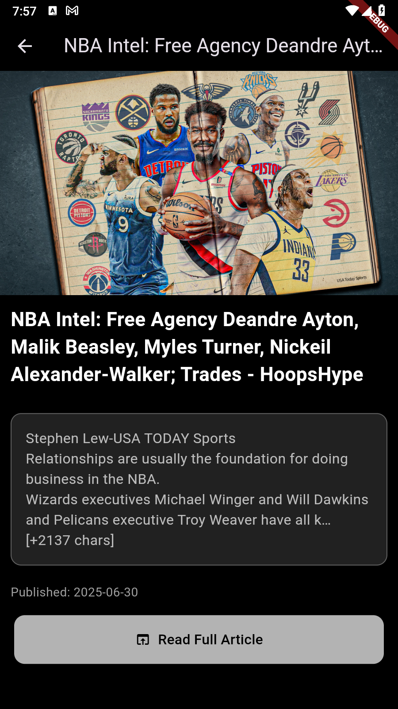

# Daily News

A Flutter-based news application that delivers top headlines across various categories, featuring Firebase Authentication for secure user access and integration with the News API for real-time news data.

<h2 align="center">📸 Screenshots</h2>

  
  &nbsp;&nbsp;&nbsp;
  
  &nbsp;&nbsp;&nbsp;
  
  &nbsp;&nbsp;&nbsp;
  

## Table of Contents
- [Features](#features)
- [Installation](#installation)
- [Dependencies](#dependencies)
- [Project Structure](#project-structure)
- [Logic Description](#logic-description)
- [Usage](#usage)
- [Contributing](#contributing)
- [Repository](#Repository)

## Features
- **User Authentication**: Secure login and sign-up using Firebase Authentication.
- **News Browsing**: View top headlines by category (e.g., general, business, sports) fetched from the News API.
- **Category Selection**: Switch between news categories via a horizontal scrollable list.
- **Article Details**: View detailed article information with an option to read the full article in a web view.
- **Data Caching**: Cache news articles locally to reduce API calls and improve performance.
- **Responsive UI**: Dark-themed interface with custom fonts and smooth navigation.
- **Error Handling**: User-friendly messages for network issues, API errors, or authentication failures.

## Installation
1. **Clone the Repository**:
   - Clone the project from GitHub: `https://github.com/AAMMMRRR/News-App`.
   - Navigate to the project directory.

2. **Install Flutter**:
   - Ensure Flutter is installed. Follow the [official Flutter installation guide](https://flutter.dev/docs/get-started/install) if needed.

3. **Install Dependencies**:
   - Run `flutter pub get` to install required packages.

4. **Set Up Firebase**:
   - Create a Firebase project in the [Firebase Console](https://console.firebase.google.com/).
   - Add your app (iOS, Android, or Web) to the Firebase project.
   - Download and place the Firebase configuration file (e.g., `google-services.json` for Android or `GoogleService-Info.plist` for iOS) in the appropriate directory.
   - Update the `firebase_options.dart` file with your Firebase project credentials (ensure they match your Firebase project).

5. **Set Up News API**:
   - Obtain an API key from [NewsAPI.org](https://newsapi.org/).
   - Update the `news_api_service.dart` file with your API key.

6. **Run the App**:
   - Execute `flutter run` to launch the application.

## Dependencies
- Firebase Core: Initializes Firebase services.
- Firebase Authentication: Manages user login and sign-up.
- HTTP: Fetches news data from the News API.
- Webview Flutter: Displays full articles in a web view.
- Google Fonts: Provides custom typography.
- Shared Preferences: Caches news articles locally.
- Flutter: Core framework for building the app.

Refer to the `pubspec.yaml` file for specific versions.

## Project Structure
- **Views**:
  - Home Screen: Displays news articles and category selection.
  - Sign-In Screen: Handles user login.
  - Sign-Up Screen: Handles user registration.
  - Details Screen: Shows detailed article information.
  - WebView Screen: Displays full articles in a browser view.
- **Widgets**:
  - Article Card: Displays individual news articles in a card format.
  - Loading: Shows a loading indicator during data fetching.
- **Controllers**:
  - News Controller: Manages news data fetching and caching.
- **Services**:
  - News API Service: Handles API requests to fetch news articles.
- **Models**:
  - Article: Defines the structure for news article data.
- **Main**: Application entry point, initializes Firebase.
- **Firebase Options**: Stores Firebase configuration for different platforms.

## Logic Description
The application follows a clear logic flow for user authentication and news browsing without delving into code specifics:

1. **App Initialization**:
   - The app initializes Firebase for authentication and starts on the sign-in screen to ensure secure access.

2. **User Authentication**:
   - **Sign-In**:
     - Users enter their email and password.
     - The system validates credentials and checks if the user exists.
     - If valid, the user is directed to the home screen with news articles.
     - Invalid credentials trigger error messages (e.g., "No user found" or "Incorrect password").
   - **Sign-Up**:
     - Users provide an email and password.
     - The system creates a new user account if the email is valid and not already in use.
     - After sign-up, the user is redirected to the sign-in screen to log in.
     - Errors (e.g., invalid email, weak password) display user-friendly messages.
   - **Sign-Out**:
     - Users can log out from the home screen, clearing cached data and returning to the sign-in screen.
     - The system ensures no news data is accessible until the user logs in again.

3. **News Browsing**:
   - **Category Selection**:
     - The home screen displays a horizontal list of categories (e.g., general, business, sports).
     - Users tap a category to load articles specific to that category.
   - **Article Loading**:
     - The system checks for cached articles for the selected category.
     - If cached data is recent (within a set time, e.g., one hour), it displays those articles.
     - Otherwise, it fetches new articles from the News API for the selected category and country (default: US).
     - Fetched articles are cached locally for future use.
   - **Article Display**:
     - Articles are shown as cards with a title, image (if available), brief description, and publication date.
     - Tapping an article navigates to a details screen.
   - **Article Details**:
     - The details screen shows the article’s title, image, content, and publication date.
     - A button allows users to view the full article in a web view.
   - **Web View**:
     - The full article is loaded in a browser view within the app, using the article’s URL.
   - **Refresh**:
     - Users can pull down to refresh the article list, fetching the latest news from the API.

4. **Data Caching**:
   - Articles are cached locally with a timestamp to track freshness.
   - Cache is cleared on logout or can be cleared for a specific category.
   - Cached data reduces API calls and improves performance when network connectivity is poor.

5. **User Interface**:
   - The sign-in and sign-up screens feature email and password fields, a submit button, and a toggle link to switch between modes.
   - The home screen includes a category selector, article list, and logout button.
   - Article cards are visually appealing with images and truncated text for readability.
   - The details screen highlights article content with a dark theme and a button to access the full article.
   - A loading indicator appears during data fetching or authentication.
   - The app uses a dark theme with custom fonts for a modern look.

6. **Error Handling**:
   - Invalid inputs (e.g., empty fields, invalid email) display clear error messages.
   - API errors (e.g., rate limit exceeded, network issues) show user-friendly messages with a retry option.
   - Authentication errors (e.g., wrong password, user not found) are communicated clearly.
   - A loading indicator prevents multiple submissions during authentication or data fetching.

## Usage
1. **Accessing the App**:
   - Open the app and land on the sign-in screen.
   - Sign up with a valid email and password, then log in with those credentials.
   - Alternatively, log in with an existing account.

2. **Browsing News**:
   - On the home screen, select a category from the horizontal list.
   - View the list of articles, each showing a title, image, and brief description.
   - Tap an article to see its details, including full content and publication date.
   - Click the"*Read Full Article"* to open the article in a web view.
   - Pull down to refresh the article list for the latest news.
   - Log out using the home screen’s logout button, which clears cached data.

3. **Data Persistence**:
   - Articles are cached locally for one hour, ensuring offline access to recent news.
   - Cache is user-specific and cleared on logout.

## Contributing
Contributions are welcome! To contribute:
1. Fork the repository.
2. Create a new branch for your feature or bug fix.
3. Make changes with clear, descriptive commits.
4. Push your branch and create a pull request.
5. Ensure your changes align with the app’s design and functionality.

## Repository
https://github.com/AAMMMRRR/News-App
